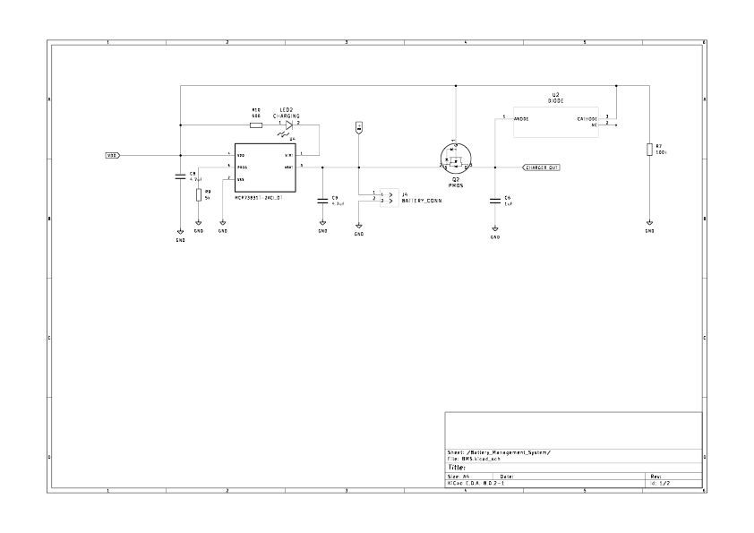

# ESP32 Microcontroller Smartwatch

This project is a custom smartwatch using the ESP32 microcontroller. The watch features a 1.44” IPS TFT display, and media control via Bluetooth wifi integration and weather notificaitons are currently under development. The entire project was developed from scratch, without relying on external libraries (except for the ones provided by ESP).

## The display 

The display code in this project is a custom library specifically designed to interface with the ST7735s LCD screen using SPI communication. It handles the initialization of the LCD, including setting up the appropriate pins and configuring the SPI parameters. The library provides functions to send commands and data to the LCD, allowing for the display of the current time and various symbols. It is optimized for efficient communication, ensuring smooth and responsive updates to the screen. By writing this display code from scratch, the project achieves a high degree of control and customization over the visual output, tailored specifically for the ESP32 microcontroller.

## Bluetooth HID Device

The Bluetooth HID media controller code in this project is a custom implementation that enables the ESP32 to function as a Bluetooth Human Interface Device (HID). This custom HID profile allows the smartwatch to communicate with paired devices and control media playback. The code handles the initialization of the Bluetooth stack, setting up the HID service, and managing the necessary HID reports. Functions are provided to send commands for play/pause, next track, previous track, and volume adjustments. By creating the Bluetooth HID profile from scratch, the project ensures precise and reliable media control functionality, seamlessly integrating with various Bluetooth-enabled devices for a smooth user experience.

## WIFI integration

WIP

## Schematic Design

### Hardware Version 2.0 (April 2025)

## Hardware Version 2.0 Updates

One of the primary challenges with V1.0 was the overall size and the number of external components required beyond the main PCB - specifically the USB-UART converter for programming and the external LiPo battery management board. Version 2.0 addresses these issues with a complete redesign that integrates all essential components onto a single PCB that's actually smaller than the LCD footprint itself.

### 1. Load Sharing Circuit

The new load sharing circuit provides intelligent power path management between the micro USB input and the LiPo battery. This implementation offers several critical advantages:

- **Seamless Power Switching**: Automatically switches between USB and battery power without interruption
- **Battery Life Extension**: When USB is connected, the circuit powers the system directly while simultaneously charging the battery, reducing unnecessary charge/discharge cycles
- **Safe Charging While Operating**: Allows the watch to remain fully functional during charging
- **Voltage Stability**: Maintains consistent 3.3V output regardless of power source or battery charge level

### 2. Integrated USB-to-Serial Programming

Version 2.0 eliminates the need for external USB-UART converters by integrating the serial programming interface directly with the micro USB port:

- **Single Cable Solution**: One micro USB cable handles both charging and programming
- **Auto-Reset Circuit**: Implements DTR/RTS auto-reset functionality for hands-free firmware uploads
- **Direct Serial Monitor Access**: Built-in serial debugging without additional hardware

### 3. On-board Li-Ion Charging IC (MCP73831T)

The MCP73831T replaces the external TP4056 module, providing a more integrated and safer charging solution:

- **Thermal Regulation**: Automatically reduces charge current if chip temperature exceeds safe limits
- **Automatic Recharge**: Initiates new charge cycle when battery drops below recharge threshold
- **Preconditioning**: Safely recovers deeply discharged batteries with trickle charge
- **Reverse Discharge Protection**: Prevents battery discharge through the charge pin

### 4. ESP32-C3-MINI Module

The transition to the ESP32-C3-MINI represents a significant advancement in both miniaturization and capability:

**Physical Advantages:**
- **Ultra-Compact**: 13.2×16.6×2.4mm - approximately 60% smaller than the WROOM-32UE
- **Integrated Antenna**: High-performance PCB antenna within the module footprint
- **Reduced Component Count**: Fewer external components required

**Technical Improvements:**
- **Native USB**: Built-in USB Serial/JTAG controller eliminates need for external USB-UART bridge
- **Peripheral Set**: 22 programmable GPIOs, 2× 12-bit ADCs, multiple timers
- **Connectivity Features**: Maintains 802.11 b/g/n support and Bluetooth 5.0 with LE support

### Design Impact

These hardware updates collectively achieve:
- **40% PCB size reduction** compared to V1.0
- **Improved user experience** with single-cable operation
- **Better power efficiency** for extended battery life
- **Professional appearance** suitable for a consumer wearable device

The V2.0 hardware platform provides a solid foundation for future software features while maintaining the project's philosophy of custom implementation and deep hardware control.## Hardware Version 2.0 Updates

### Hardware Version 1.0 (August 2024)

Components 
1. ESP32-WROOM 32UE (this version comes with an antenna)
1. 220mAh Lithium Polymer Battery (3.7V)
1. TP4056 charging board
1. MCP1700T LDO Voltage Regulator
1. 1.69 inch LCD module (ST7789V2 driver)
1. USB to TTL serial converter for flashing
1. Pushbuttons, headers, capacitors, resistors

The schematic for the watch contains many sub systems that are designed to fulfill a specific functionality, some essential and some for ease of use. The ESP32 was chosen for its wide use, integrated antenna, great low power bluetooth and bluetooth classic capabilities, price point and I/O support.

### Battery monitoring

The battery monitoring circuit is very simple, it uses a voltage divider consisting of resistors R3 (100 kΩ) and R4 (27 kΩ) to scale down the battery voltage to a level suitable for the ESP32's ADC input on GPIO36. This configuration allows the ESP32 to monitor the battery's voltage in real-time, enabling precise measurement of the battery’s state of charge. By converting the analog voltage to a digital value, I can assess the battery’s condition and display a battery life indicator to the user and power off the system once a certain threshold is reached.

### Charging Circuit

The charging circuit is built around the TP4056, a dedicated Li-Ion battery charging IC. The TP4056 regulates charging current and voltage to safely charge the connected LiPo battery (BT1) via the CHARGER_OUT pin. The MCP1700T-3302E/TT low-dropout regulator further stabilizes the output to 3.3V, powering the ESP32 and other components. This circuit ensures that the battery is efficiently charged while protecting it from overcharging or deep discharge, extending battery life.

### Flashing Circuit

The flashing circuit facilitates firmware updates and debugging for the ESP32. It includes a UART interface for serial communication, where UARTTX and UARTRX connect to the ESP32’s TXD and RXD pins. The BOOT and EN buttons allow manual control over the ESP32’s boot mode, with BOOT pulling GPIO0 low to enter flashing mode, while EN resets the ESP32. Resistors R6 (10 kΩ) and R7 (10 kΩ) ensure stable signal levels, making the flashing process reliable and user-friendly.

## PCB Design

### Hardware V2.0

  
  

The V2.0 PCB layout achieves significant space efficiency through careful component placement and routing optimization. Strategic test points have been added for critical signals (3.3V, GND, TX/RX, GPIO0) to facilitate debugging during development. Additionally, the direct battery solder connections have been replaced with a JST PH 2.0mm header, enabling easy battery replacement and safer prototyping. These improvements, combined with modular grouping of subsystems, result in a cleaner, more maintainable design that's both development-friendly and suitable for final production.

### Hardware V1.0

  

Here is V1 of the PCB for the watch,

Capacitors C1 and C2 are placed close to the LDO regulator to filter out noise and ensure a stable supply voltage. The power lines are routed to minimize noise interference with analog components, maintaining the integrity of signals.

The ESP32 module is centrally placed for easier routing. The antenna area is kept clear of any traces or components to optimize the wireless signal, which is crucial for Bluetooth and Wi-Fi communications.

The board integrates two tactile switches for user interaction, placed perpendicular to the board for ergonomics.

The PCB includes a connector (U4) for an LCD display, with the necessary SPI lines broken out for communication.

### Improvements

A possible enhancement for this design would be to add a breakout for unused GPIOs, this would have made debugging significantly easier and allowed for some simple expansions without the need for redesigning or reprinting new PCBs.

Another addition that could have made debugging easier is adding a few LED indicators. For this design I was trying to keep things quite minimal however I believe this could have been a very helpful quality of life improvement and could also be used for functional purposes. 

Lastly, I plan on making a version 2 with a much smaller PCB, the form factor and placement could be optimized and including a TP4056 type lipo charging system on the board itself could also lead to a much simpler enclosure.

Adding an RC filter for switch debouncing, for the user operated switches to ensure more reliable input detection.

## Enclosure

WIP

## Images (Updated April '25)

Here is the assembled V2.0 of the watch and a comparison to V1 to see how much the PCBs differ in size.

 
 

## Images (Updated Sep '24)

The assembled PCB with a new 240x280 pixel screen, battery level indicator, and media control icons.

 

## Images (Updated May '24)

These images are from when I was testing the first versions of my display library with an ESP32 dev board and LCD module.

 
 

